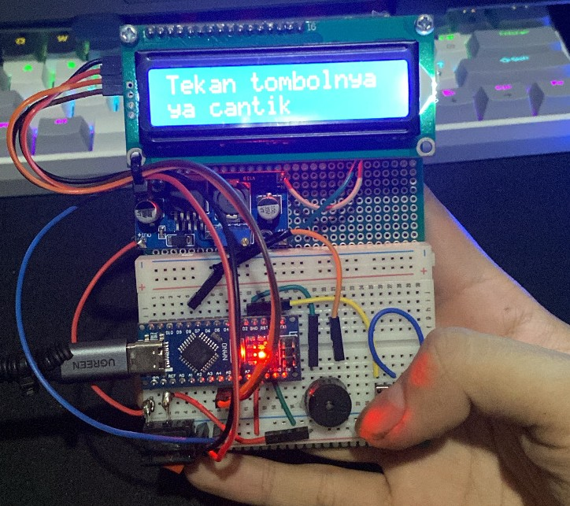
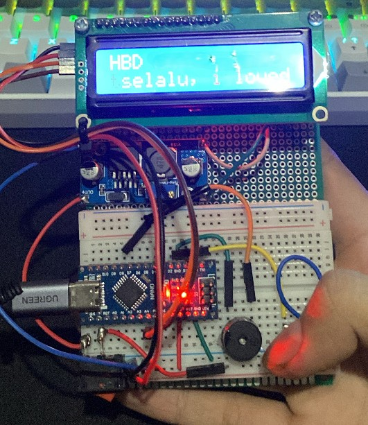

# 🎁 Interactive Arduino Birthday Gift Box

A hardware-based interactive birthday gift box project. This device displays a standby greeting on an LCD screen and, upon a button press, plays a "Happy Birthday" melody while seamlessly scrolling a customized message.

Built with an **Arduino Nano** and programmed via the **PlatformIO (C++)** environment, this project serves as a compact and creative IoT/embedded systems portfolio piece.

## ✨ Key Features
* **Interactive Trigger:** The system remains in a standby state with a static greeting until the user interacts with the tactile push button.
* **Audio Playback:** Generates a birthday melody using a passive buzzer via the `tone()` function.
* **Dynamic Scrolling Text:** Displays an extended custom message on a 16x2 I2C LCD using a custom auto-scrolling algorithm synchronized with the melody tempo.
* **Portable Power Ready:** Integrates an MT3608 DC-DC Step-Up Converter for 5V voltage stabilization, making it ready to be powered by a portable 3.7V Li-Po battery system.

## 📸 Hardware Showcase

*The LCD displaying the standby prompt.*

 
*The system executing the melody and scrolling text sequence.*

## 🛠️ Components Used
1. Arduino Nano V3 (ATmega328P CH340)
2. 16x2 LCD Display with I2C Module
3. Passive Buzzer (5V)
4. Tactile Push Button
5. MT3608 DC-DC Step-Up Boost Converter
6. Mini Breadboard & Perfboard
7. Dupont & Solid Jumper Wires

## 🔌 Wiring & Pinout
The microcontroller is wired using the following configuration:

| Component | Arduino Nano Pin | Note |
| :--- | :--- | :--- |
| **Buzzer (+)** | `D8` | Configured as OUTPUT |
| **Buzzer (-)** | `GND` | Ground |
| **Push Button** | `D2` | Configured with `INPUT_PULLUP` |
| **Button (Other side)**| `GND` | Ground |
| **LCD I2C SDA** | `A4` | I2C Data Line |
| **LCD I2C SCL** | `A5` | I2C Clock Line |
| **LCD VCC** | `5V` | Display Power |
| **LCD GND** | `GND` | Ground |

## 🚀 Getting Started (PlatformIO)
1. Clone this repository to your local machine.
2. Open the project folder using **Visual Studio Code** with the **PlatformIO IDE** extension installed.
3. Ensure the `marcoschwartz/LiquidCrystal_I2C` library dependency is listed in your `platformio.ini`.
4. Connect the Arduino Nano to your computer via USB.
5. Click **Build** to compile the firmware and **Upload** to flash it to the board.

## 👨‍💻 Author
**Syarif Saputra**
* Informatics Engineering Student
